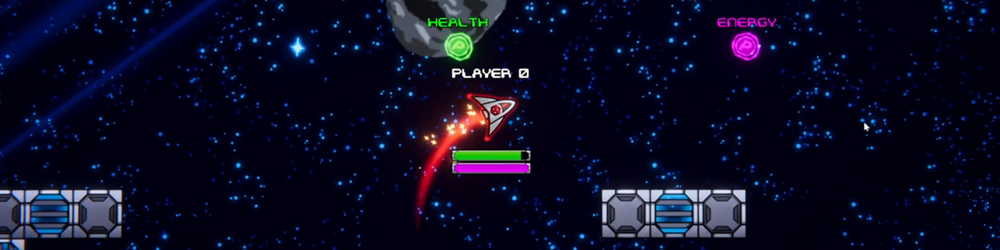

  

# 2D Space Shooter

  

This is a UNet sample project converted to Netcode for GameObjects. The 2DSpaceShooter sample is a bitesize sample designed to demonstrate networked 2D and physics-based character movement. 
  

# Sample Overview

In this sample, learn more about:

- Server authorative physics based movement using Netcode for GameObject's `NetworkRigidbody2D` component
- Managing health and a list of buffs for your players in a multiplayer game with a `NetworkVariable`
- How to pool network objects such as bullets and asteroids to improve performance
  
---
### 💡 Documentation
Check out the [2D Space Shooter sample documentation](https://docs-multiplayer.unity3d.com/netcode/current/learn/bitesize/bitesize-spaceshooter) for a more in-depth technical breakdown of our engineering decisions and why the sample works the way it does.

---
 

## Exploring the Sample

The entry scene for this game is the network scene. From there a game can be hosted or an existing game can be joined. Control the ship using WASD and shoot asteroids (or other players!) using the spacebar. Fly over pickups in the scene to get different temporary buffs for your ship (like increased fly speed or shooting extra bullets).
  

---
### 💡 Bitesize Readme
Check out our main [Bitesize Samples GitHub Readme](https://github.com/Unity-Technologies/com.unity.multiplayer.samples.bitesize#readme) for more documentation, resources, releases, contribution guidelines, and our feedback form.

---
 

