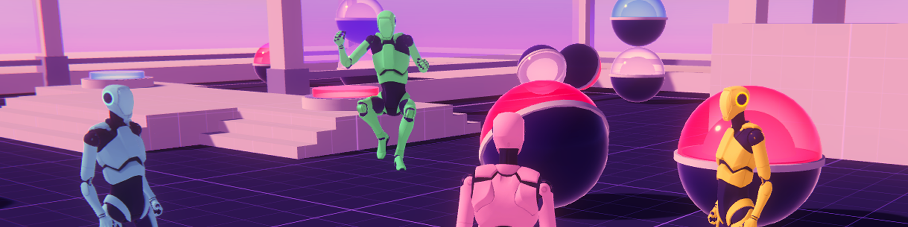

  

# Client Driven

  

The ClientDriven sample is a sample project made with Netcode for GameObjects designed to demonstrate responsive 3rd-person WASD character movements even under unfavourable network conditions.
  

# Sample Overview

In this sample, learn more about:

- Client driven movements
- Networked physics
- Spawning vs in-scene placed `NetworkObjects`
- `NetworkObject` parenting (client side object detection with server side pickup)
  
---
### 💡 Documentation
Check out the [Client Driven sample documentation](https://docs-multiplayer.unity3d.com/netcode/current/learn/bitesize/bitesize-clientdriven) for a more in-depth technical breakdown of our engineering decisions and why the sample works the way it does.

---
 

## Exploring the Sample
The entry scene for this game is the Bootstrap scene. From there a game can be hosted or an existing game can be joined. Run around the scene using WASD, and pick up orbs using the spacebar. Convert orbs from one color to another by dropping them in the converters in the middle of the level. Deposit orbs into the drop spots of the same color to earn points. 
  

---
### 💡 Bitesize Readme
Check out our main [Bitesize Samples GitHub Readme](https://github.com/Unity-Technologies/com.unity.multiplayer.samples.bitesize#readme) for more documentation, resources, releases, contribution guidelines, and our feedback form.

---
 

