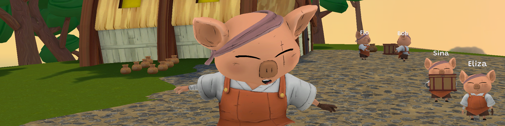

  

# Distributed Authority Social Hub Sample
 

  

Social Hub is a beginner-friendly sample project aimed to demonstrate Distributed Authority's core features and benefits, helping users seamlessly integrate Distributed Authority into their own game projects.

Distributed Authority, a networking topology offered by Netcode for GameObjects v2+, is a flexible authority model and an out-of-the-box backend solution, targeting developers who require scalable, performant, and cost-effective networking options.

 

# Social Hub Overview

Within Social Hub, you are free to explore Distributed Authority's key features & functionalities in a sandbox-like environment. Such features include: 
* Automatic redistribution of ownership of NetworkObjects across connected clients
* Client-side NetworkObject spawning and deferred NetworkObject despawning
* Ownership transfer of NetworkObjects with variable ownership flags
* Host migration of a networked game session

 

## Requirements

Social Hub is compatible with the latest Unity Long Term Support (LTS) editor version, currently [6000.0 LTS](https://unity.com/releases/unity-6). Please include standalone support for Windows/Mac in your installation.

Social Hub has been developed and tested on the following platforms:
- Windows
- Mac
- Android (Pixel 6)
- iOS (iPhone 13)

 

## Opening the project for the First Time

Once you have downloaded the project, follow the steps below to get up and running:
- Check that you have installed the most recent [LTS editor version](https://unity.com/releases/editor/archive).
  - Include standalone support for Windows/Mac in your installation. 
- Add the project to the _Unity Hub_ by clicking on the **Add** button and pointing it to the root folder of the downloaded project.
- Hit the **Play** button. You can then host a new game or join an existing one using the in-game UI.

 

## Exploring the project

Social Hub is an 64-player sandbox-style multiplayer experience where players can interact and collaborate within a simulated world. The control model is WASD controls, with the E button mapped as the key to interact with crates and pots. These NetworkObjects can be picked up and subsequently dropped or tossed, showcasing how to attach one NetworkObject to another with an animated rig through the use of FixedJoints. As a NetworkObject is picked up by a client, authority of that NetworkObject is transferred to that client.

A client has authority over its player NetworkObject, thus the movement, animations, and interactions performed by a client are client-authoritative. 

Code is organized in domain-based assemblies.

 

### Registering the project with Unity Gaming Services (UGS)

Social Hub leverages several services from UGS to facilitate connectivity between players. To use these services inside your project, you must [create an organization](https://support.unity.com/hc/en-us/articles/208592876-How-do-I-create-a-new-Organization-) inside the Unity Dashboard. Consult the Multiplayer SDK [Getting Started](https://docs.unity.com/ugs/en-us/manual/mps-sdk/manual/get-started) manual for more resources.

 

## Testing multiplayer

In order to see the multiplayer functionality in action, launch multiple instances of the game locally on your computer, using either Multiplayer Play Mode or standalone builds, and connect using the same session name. Friends can join along too, so long as they join via the Main Menu with the same session name. See [how to test](https://docs-multiplayer.unity3d.com/netcode/current/tutorials/testing/testing_locally) for more info.

 

## 💡 Bitesize Readme

Check out our main [Bitesize Samples GitHub Readme](https://github.com/Unity-Technologies/com.unity.multiplayer.samples.bitesize#readme) for more documentation, resources, releases, contribution guidelines, and our feedback form.

 

