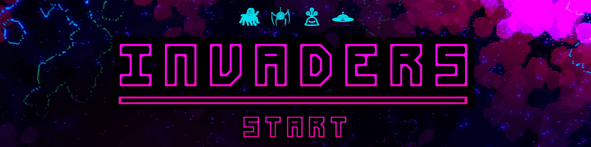

  

# Invaders

  

This is a UNET sample project converted to Netcode for GameObjects. The Invaders sample is a sample project designed to demonstrate game flows and game modes.
  

# Sample Overview

In this sample, learn more about:

- Simple start, lobby, and finish flow with Netcode for GameObjects using Scene Management
- Unconventional movement networked
- Client driven movement with Client Network Transform
- Shared timer between clients in a client-sided predicted way
  
---
### 💡 Documentation
Check out the [Invaders sample documentation](https://docs-multiplayer.unity3d.com/netcode/current/learn/bitesize/bitesize-invaders) for a more in-depth technical breakdown of our engineering decisions and why the sample works the way it does.

---
 

## Exploring the Sample
The entry scene for this game is the InitBootStrap scene. From there a game can be hosted or an existing game can be joined. Move back and forth using the A and D keys, and shoot using the spacebar. Shoot enemies to gain points, and avoid their bullets to avoid losing health (and eventually losing)!
  

---
### 💡 Bitesize Readme
Check out our main [Bitesize Samples GitHub Readme](https://github.com/Unity-Technologies/com.unity.multiplayer.samples.bitesize#readme) for more documentation, resources, releases, contribution guidelines, and our feedback form.

---
 

