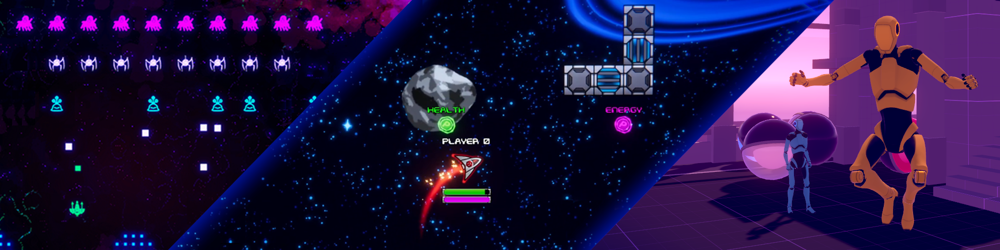

  
# Netcode for GameObjects Bitesize Samples

*

  

*: Due to a regression in Netcode for GameObjects pertaining to the destruction of NetworkObjects when a client unsuccessfully connects, the Dynamic Addressables Network Prefabs sample has remained at v1.7.1. It will be upgraded in the near future with the latest Netcode version including a fix for the regression.

This repository contains a collection of bitesize sample projects and games that showcase different techniques
which can help you get started with development of a multiplayer 
project using [Netcode for GameObjects](https://github.com/Unity-Technologies/com.unity.netcode.gameobjects).
  

# Bitesize Samples Overview

### 2D Space Shooter Overview

The [2D Space Shooter Sample](https://github.com/Unity-Technologies/com.unity.multiplayer.samples.bitesize/tree/main/Basic/2DSpaceShooter) was a UNET sample that has been converted over to NGO. Check it out to learn more about physics movement and status effects using Netcode `NetworkVariables` and `ObjectPooling`.
  

### Distributed Authority Social Hub

[Social Hub](https://github.com/Unity-Technologies/com.unity.multiplayer.samples.bitesize/tree/main/Basic/DistributedAuthoritySocialHub) is built with the Distributed Authority topology, showcasing recommended approaches to designing gameplay features with the new framework inside Netcode for GameObjects v2.0 in tandem with the Multiplayer SDK. This sample serves as the educational entry point for users who are looking to implement a similar networking topology inside their projects.
  

### Multiplayer Use Cases Overview

The [Multiplayer Use Cases sample](https://github.com/Unity-Technologies/com.unity.multiplayer.samples.bitesize/tree/main/Basic/MultiplayerUseCases) show you how to perform common actions in a multiplayer environment, so that you can build the features of your game with them in mind.

In this sample you'll learn about the core features of Netcode For GameObjects (Netcode) through practical examples that you'll be able to extend and adapt to fit the gameplay logic of your own game. 

Each scene comes with an in-editor tutorial that will help you explore the main scripts and object of each scene, so you know where to look at to find what you're looking for.
  

### Client Driven Overview
See the [Client Driven Sample](https://github.com/Unity-Technologies/com.unity.multiplayer.samples.bitesize/tree/main/Basic/ClientDriven) to learn about client driven movements, networked physics, spawning vs in-scene placed `NetworkObjects`, and `NetworkObject` parenting.
  

### Dynamic Addressables Network Prefabs Overview

Check out the [Dynamic Addressables Network Prefabs Sample](https://github.com/Unity-Technologies/com.unity.multiplayer.samples.bitesize/tree/main/Basic/DynamicAddressablesNetworkPrefabs) to learn more about the dynamic prefab system, which allows us to add new spawnable network prefabs at runtime.
  

---
## Readme Contents and Quick Links

 
 Click to expand/collapse contents 

- ### [Getting the Project](#getting-the-project-1)
- ### [Requirements](#requirements-1)
- ### [Troubleshooting](#troubleshooting-1)
  - [Bugs](#bugs)
  - [Documentation](#documentation)
- ### [Contributing](#contributing-1)
- ### [Community](#community-1)
- ### [Feedback Form](#feedback)
- ### [Other Samples](#other-samples-1)
  - [Boss Room](#boss-room-sample)

---
 

## Getting the project
### Direct download

 - You can download the latest versions these samples from our [Releases](https://github.com/Unity-Technologies/com.unity.multiplayer.samples.bitesize/releases) page

 - __Alternatively:__ select `Code` and select the 'Download Zip' option.  Please note that this will download the branch you're currently viewing on Github
  

## Requirements

The bitesize samples are compatible with the latest Unity Long Term Support (LTS) editor version, currently [2022 LTS](https://unity.com/releases/editor/qa/lts-releases?version=2022.3) and are supported on the Windows 10 and Mac OSX platforms. Please include standalone support for Windows/Mac in your installation.

**PLEASE NOTE:** You will also need Netcode for Game Objects to use these samples. See the [Installation Documentation](https://docs-multiplayer.unity3d.com/netcode/current/installation) to prepare your environment. You can also complete the [Get Started With NGO](https://docs-multiplayer.unity3d.com/netcode/current/tutorials/get-started-ngo) tutorial to familiarize yourself with Netcode For Game Objects.
  

## Troubleshooting
### Bugs
- Report bugs in the Bitesize samples using Github [issues](https://github.com/Unity-Technologies/com.unity.multiplayer.samples.bitesize/issues)
- Report NGO bugs using NGO Github [issues](https://github.com/Unity-Technologies/com.unity.netcode.gameobjects/issues)
- Report Unity bugs using the [Unity bug submission process](https://unity3d.com/unity/qa/bug-reporting)
  
### Documentation
For a deep dive into Netcode for GameObjects and the Bitesize Samples, visit our [documentation site](https://docs-multiplayer.unity3d.com/).
  

## Community
For help, questions, networking advice, or discussions about Netcode for GameObjects and its samples, please join our [Discord Community](https://discord.gg/FM8SE9E) or create a post in the [Unity Multiplayer Forum](https://forum.unity.com/forums/netcode-for-gameobjects.661/).
  

## Contributing
We welcome your contributions to this sample code and objects. See our [contribution guidelines](CONTRIBUTING.md) for details.
  

## Feedback
If you have tried these samples already, please consider leaving us feedback [here](https://unitytech.typeform.com/bitesize)--it will only take a couple of minutes. Thanks!
  

## Other samples
### Boss Room Sample
[Boss Room](https://github.com/Unity-Technologies/com.unity.multiplayer.samples.coop/) is a fully functional co-op multiplayer RPG made with Unity Netcode. It is an educational sample designed to showcase typical netcode patterns that are frequently featured in similar multiplayer games.
  

