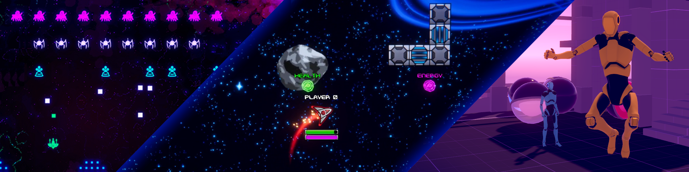

# Netcode for GameObjects Bitesize Samples

|Unity Version|Netcode Version|Latest Release|
|:-----------:|:-------------:|:------------:|
|2021.3+ LTS  |1.2.0+        |[1.2.0](https://github.com/Unity-Technologies/com.unity.multiplayer.samples.bitesize/releases/tag/v1.2.0)|

This repository contains a collection of bitesize sample projects and games that showcase different 
sub-features of Netcode. You can review these samples with [documentation](https://docs-multiplayer.unity3d.com/netcode/current/learn/bitesize/bitesize-introduction) to better understand APIs and features.
  

## Contents

* [2D Space Shooter Sample](https://github.com/Unity-Technologies/com.unity.multiplayer.samples.bitesize/tree/main/Basic/2DSpaceShooter) - Learn more about physics movement and status effects using Netcode `NetworkVariables` and `ObjectPooling`

* [Invaders Sample](https://github.com/Unity-Technologies/com.unity.multiplayer.samples.bitesize/tree/main/Basic/Invaders) - Learn more about game flow, modes, unconventional movement networked, and a shared timer

* [Client Driven Sample](https://github.com/Unity-Technologies/com.unity.multiplayer.samples.bitesize/tree/main/Basic/ClientDriven) - Learn more about Client driven movements, networked physics, spawning vs statically placed objects, object reparenting

* [Dynamic Prefabs Sample]()  - Learn more about the dynamic prefab system, which allows us to add new spawnable prefabs at runtime
  

## Getting the project
### Direct download

 - You can download the latest versions of these samples from our [Releases](https://github.com/Unity-Technologies/com.unity.multiplayer.samples.bitesize/releases/tag/v1.2.0) page

 - __Alternatively:__ select `Code` and select the 'Download Zip' option.  Please note that this will download the branch you're currently viewing on Github
  

## Who are these this for?

The samples in this repository will help you get started with development of a multiplayer 
project using [Netcode for GameObjects](https://github.com/Unity-Technologies/com.unity.netcode.gameobjects). 
  

## Requirements

You will need Unity and Netcode for GameObjects installed to use these samples. Complete the [Hello World Getting Started](https://docs-multiplayer.unity3d.com/netcode/current/tutorials/helloworld) to prepare your environment. You can then access and use these samples for Netcode for GameObjects in a more self-contained scenario.
  

## Community and Feedback

For help, questions, networking advice, or discussions about Netcode for GameObjects and its samples, please join our [Discord Community](https://discord.gg/FM8SE9E) or create a post in the [Unity Multiplayer Forum](https://forum.unity.com/forums/netcode-for-gameobjects.661/).
  

## Maintenance

The Netcode for GameObjects Bitesize Samples repository will be maintained and updated with the latest released Netcode for GameObjects version and Unity LTS version. See this readme and the [changelog](https://github.com/Unity-Technologies/com.unity.multiplayer.samples.bitesize/blob/main/CHANGELOG.md) for supported versions.
  

## Other samples
See our other samples for more multiplayer content
- [Boss Room, a small scale co-op game](https://github.com/Unity-Technologies/com.unity.multiplayer.samples.coop/releases/latest)
  

## Contributing
We welcome your contributions to this sample code and objects. See our [contribution guidelines](CONTRIBUTING.md) for details.
  

## Feedback
If you have tried these samples already, please follow the link to fill out your feedback: https://unitytech.typeform.com/bitesize - ETA: 1 min 30 secs.
  

